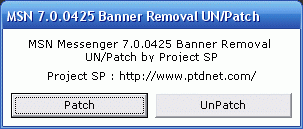



## MSN Messenger 7\.0\.0425 Banner Removal UN/Patch by Project SP

### Description

This MSN 7.0.0425 Patch Will Allow You To Remove The Banner Which Shows At the Bottom Of the Messenger.
 
### More Info
 

             |
---                |---
**Submitted On**   |2005-01-21 05:12:18
**By**             |[Salman Paji](https://github.com/Planet-Source-Code/PSCIndex/blob/master/ByAuthor/salman-paji.md)
**Level**          |Intermediate
**User Rating**    |5.0 (15 globes from 3 users)
**Compatibility**  |VB 6\.0
**Category**       |[Complete Applications](https://github.com/Planet-Source-Code/PSCIndex/blob/master/ByCategory/complete-applications__1-27.md)
**World**          |[Visual Basic](https://github.com/Planet-Source-Code/PSCIndex/blob/master/ByWorld/visual-basic.md)
**Archive File**   |[MSN\_Messen1842431212005\.zip](https://github.com/Planet-Source-Code/salman-paji-msn-messenger-7-0-0425-banner-removal-un-patch-by-project-sp__1-58410/archive/master.zip)

